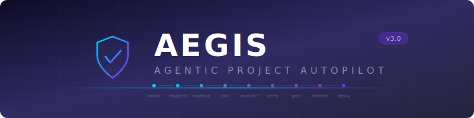

<p align="center">
  
</p>

<h1 align="center">Aegis</h1>
<p align="center">
  <strong>Agentic Project Autopilot</strong><br/>
  <em>From idea to deployment — with hard gates, evidence trails, and multi-model review.</em>
</p>

<p align="center">
  <a href="#installation"></a>
  <a href="LICENSE"></a>
  <a href="https://github.com/obra/get-shit-done"></a>
  <a href="https://docs.anthropic.com/en/docs/claude-code"></a>
</p>

---

A meta-orchestrator that guides software projects from ideation through deployment, wrapping [GSD](https://github.com/obra/get-shit-done), [Engram](https://github.com/cyanheads/engram-mcp-server), and Sparrow into a single pipeline with hard gates between stages.

## The Pipeline

```
  INTAKE ──→ RESEARCH ──→ ROADMAP ──→ PHASE PLAN ──→ EXECUTE
    │            │            │            │              │
    ▼            ▼            ▼            ▼              ▼
 [capture]   [explore]    [plan]     [detail]        [build]
    │            │            │            │              │
    └────────────┴────────────┴────────────┴──────────────┘
                              │
                    ┌─────────┴─────────┐
                    ▼                   ▼
                 VERIFY ──→ TEST GATE ──→ ADVANCE ──→ DEPLOY
                    │           │            │           │
                    ▼           ▼            ▼           ▼
              [validate]   [evidence]   [checkpoint] [preflight]
                            [policy]                  [ship it]
```

Each stage has **hard gates** — you can't skip ahead without satisfying the previous stage's exit criteria. Every gate decision is backed by structured evidence artifacts.

## Key Features

| Feature | Description |
|---------|-------------|
| **9-Stage Pipeline** | Structured progression from idea to deployment with no shortcuts |
| **Policy-as-Code** | Gate behavior configured in versioned `aegis-policy.json` |
| **Evidence Artifacts** | Every gate decision backed by structured, auditable evidence |
| **Multi-Model Review** | Sparrow (DeepSeek free) + Codex (GPT paid) at critical gates |
| **Persistent Memory** | Engram integration for cross-session, cross-project context |
| **Graceful Degradation** | Works without Engram or Sparrow (reduced features, never blocks) |
| **Specialist Subagents** | Research, planning, execution, and verification — each a focused agent |
| **Rollback Drills** | Built-in rollback testing before deployment |

## Prerequisites

- [Claude Code CLI](https://docs.anthropic.com/en/docs/claude-code) installed and configured
- [GSD framework](https://github.com/obra/get-shit-done) installed as Claude Code skills
- Bash 4+ (ships with most Linux/macOS systems)
- Python 3 (for JSON manipulation in gate scripts)

### Optional Integrations

- **[Engram](https://github.com/cyanheads/engram-mcp-server)** — Persistent cross-project memory (MCP plugin). Falls back to local JSON if unavailable.
- **Sparrow** — Cross-model consultation bridge. Pipeline continues without it (skips external review).

## Installation

```bash
# Clone the repo
git clone https://github.com/gatambo/aegis.git
cd aegis

# Make the CLI executable
chmod +x scripts/aegis

# Add to PATH (or symlink)
ln -s "$(pwd)/scripts/aegis" ~/.local/bin/aegis
```

### Environment Variables

| Variable | Default | Description |
|----------|---------|-------------|
| `AEGIS_HOME` | Auto-detected from script location | Root directory of Aegis |
| `AEGIS_SPARROW_PATH` | `sparrow` (on PATH) | Path to Sparrow bridge script |
| `AEGIS_ENGRAM_CMD` | `engram` | Engram CLI command |
| `AEGIS_ENGRAM_SOCK` | `/tmp/engram.sock` | Engram socket path |

## Usage

```bash
# Launch the pipeline for a new project
aegis

# Or invoke directly as a Claude Code skill
# (skill file: skills/aegis-launch.md)
```

Aegis will:
1. Detect available integrations (Engram, Sparrow, Codex)
2. Initialize project state in `.aegis/`
3. Walk you through each stage with hard gates

## Project Structure

```
aegis/
├── CLAUDE.md              # Project instructions for Claude Code
├── aegis-policy.json      # Gate configuration (policy-as-code)
├── scripts/aegis          # CLI entry point
├── lib/                   # Core bash libraries (12 modules)
│   ├── aegis-state.sh     #   State machine and transitions
│   ├── aegis-detect.sh    #   Integration detection
│   ├── aegis-gates.sh     #   Gate evaluation logic
│   ├── aegis-memory.sh    #   Memory operations (Engram + fallback)
│   ├── aegis-consult.sh   #   Sparrow/Codex consultation
│   ├── aegis-validate.sh  #   Subagent output validation
│   ├── aegis-evidence.sh  #   Evidence artifact management
│   ├── aegis-policy.sh    #   Policy loader
│   ├── aegis-checkpoint.sh #  Stage checkpoint snapshots
│   ├── aegis-git.sh       #   Git operations
│   ├── aegis-patterns.sh  #   Pattern library
│   └── aegis-rollback.sh  #   Rollback drill
├── workflows/
│   ├── pipeline/orchestrator.md  # Main orchestrator
│   └── stages/            # Per-stage workflow definitions (9)
├── skills/                # Claude Code skill files
├── templates/             # State and policy templates
├── references/            # Integration specs, model routing, protocols
├── tests/                 # Test suite (20+ test files)
└── docs/                  # Architecture documentation
```

## Testing

```bash
# Run all tests
bash tests/run-all.sh

# Run a specific test
bash tests/test-state-transitions.sh
```

## Policy Configuration

Gate behavior is configured in `aegis-policy.json`:

```json
{
  "gates": {
    "test-gate": {
      "mode": "enforce",
      "min_evidence": 2,
      "require_consultation": true
    }
  }
}
```

See `templates/aegis-policy.default.json` for the full default configuration.

## Acknowledgements

Aegis is built on top of [Get Shit Done (GSD)](https://github.com/obra/get-shit-done) by Jesse Vincent — the planning, execution, and verification framework that makes agentic development actually work. GSD provides the foundation that Aegis orchestrates: phase planning, atomic execution, goal-backward verification, and the discipline to ship rather than spin.

## License

MIT
